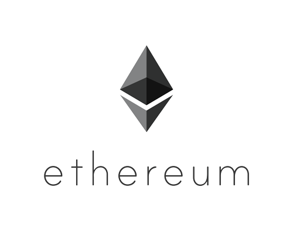

# Your own Ethereum blockchain on Microsoft Azure

*Note: this tutorial works as of 12 Jan 2018, please let me know if it doesn’t
work*

 _**Blockchain, Ethereum, Bitcoin, decentralized apps, smart contracts.** Yada yada yada._
These things have been quite the news these days, but how do
they actually *work*? One cool (doubly cool?) way to understand how they work is
to set up your own Ethereum *private testnet*, a private network of an Ethereum
blockchain that you own. This tutorial assumes that you already have a Microsoft
Azure account set up. You can also use your own computer(s) or other cloud
service providers such as Google’s Cloud Platform or Amazon’s AWS, but I won’t
be teaching how to use those.



<sup>_Vitalik Buterin’s brainchild (credits to Ethereum Foundation)_</sup>

Before we start, here is a quick background on Ethereum.

**Ethereum** was proposed in late 2013 by *Vitalik Buterin*, and is an
**open-source**, blockchain-based **distributed computing platform**. These two
features are very important, because they allow *anyone* to build on top of
Ethereum, create *smart contracts* that will run on the Ethereum blockchain, and
allow anyone to create their own Ethereum-based blockchain.

However, it is most popularly known as a **cryptocurrency. **One** **common
misconception is that Ethereum is the *cryptocurrency*, but that part of
Ethereum has an actual name: **Ether. **Ethereum also uses ‘**Gas**’ for pricing
transactions within the Ethereum blockchain, unlike Bitcoin, which uses Bitcoins
for transactional costs.
[Here](https://medium.com/startup-grind/gentle-intro-to-blockchain-and-smart-contracts-part-1-3328afca62ab)
is a nice introduction to blockchain and smart contracts by [Lucas
Kai](https://medium.com/@lucaskai) if you want to know more.

### Alright, now how do I start?

As stated above, this tutorial assumes that you already have a Microsoft Azure
account set up, but you can also use other methods to set up PCs for hosting the
testnet.

Some terminology before we start:

Instance — a virtual machine that has been created on the cloud platform

Virtual machine — a computer that exists virtually (i.e. a computer running
inside another computer)

Node — a computer/participant on the network that processes blockchain
transactions

#### Step 1: Set up your computer(s) or virtual machine instances

I am only going to go through the steps for *Microsoft Azure*, as I am most
familiar with it. You can use other platforms as well. I have tested using
Ubuntu on Azure, Windows and Ubuntu on GCP (Google Cloud Platform), and it
works. The steps will be different, but the settings should be similar.

Open up *Virtual Machines*** **on the left panel of the [Microsoft
Azure](https://portal.azure.com/) dashboard and click on ‘*Add*’ on the toolbar.
Search for ‘*Windows 10*’ and choose ‘*Windows 10 Pro*’.

Click on it, and create a VM. Fill in the fields. Do not forget them, especially
the password. If you can, choose *SSD* as the VM disk type.

If you can afford it (Microsoft Azure’s free credit should be enough for it),
select a VM with at least 4 vCPUs, or you will be forced to wait for quite a
while for the VM to process. Choose a minimum of 8GBs of RAM. If you cannot find
the VM you want, click ‘View all’ near the sliders for vCPU and memory. For this
tutorial, I will choose **DS3_V2 Standard** as my VM configuration.

Do not worry about the price, as it assumes you are running it 24/7 for a full
month. You can shut down and delete the instance when you are done to save
costs.


<sup>_My configuration — yours should look similar_</sup>

The next screen should show something like this (I named my instance bc1, hence
the prefix). **Important: **set up a static IP for your instance. Open *‘Public
IP Address’ *and create a new public IP address. Use the default name for the
public IP address. Select *‘Static’ *for Assignment. Then choose ‘*None’ *for
*Network security group (firewall). ***Make sure you set the static IP and
remove the firewall, or else your VM will not work for this tutorial. **Leave
everything else as it is, unless you know what you are doing.

Click ‘*Ok’, *accept the Terms of use and create your instance. By then, you
should have a tile appear on your Dashboard that says *‘Deploying Windows 10
Pro, Version 1709’* (for my case, it is version 1709, but yours might be
different. It does not matter). Repeat the steps to create a second instance, up
to as many as you want. It should take a while to deploy, so grab a cup of
coffee or have a stretch while you wait.

#### Step 2: Connecting to your cloud instance

Select your VM and click on ‘*Connect’* on the toolbar. It should download a
.rdp file. This assumes you chose Windows for your VM instance.


<sup>_See the ‘Connect’ button on the toolbar? Click on it._</sup>

For Windows users: simply double click on the .rdp file and enter your VM
credentials to connect to your VM when prompted.

For Linux users: you can download [Remmina](https://www.remmina.org/) and use it
to connect to your VM. Open the .rdp file in a text editor, and copy the IP
address that is after `full address:s:` Mine, for example was `52.170.7.80:3389`
Then, open Remmina and make a new connection. Give your connection a name, then
paste the IP address into the *‘Server’* field. Enter your VM’s username and
password, then click *‘Connect’. *You should be able to connect to your VM now.
(optional: you can change the color depth if you have a fast connection for
better quality visuals)

You should then be greeted with the Windows sign-in page. Wait for it to
complete the initial setup, and you should be on the Windows Desktop.

If you used a different operating system for your VM instance, I will assume
that you will also have knowledge on how to connect to your VM through SSH or
VNC.

#### Step 3: Installing Geth (Ethereum implementation in Go)

Open up
[https://geth.ethereum.org/downloads](https://geth.ethereum.org/downloads) in
your virtual machine and download the latest **stable** version for the
operating system you have chosen. For Windows users, there is no need to check
‘*Development Tools’ *when installing, but it is up to you. When it is done
installing, do the same on your second (and third, and fourth, if you decided to
use that many nodes)

When you are done, open up Command Prompt (Win+R then type in `cmd` and Enter)
and type `geth help` . If a list of instructions is displayed, then it means
geth has been successfully installed.

Try it on all your nodes to make sure they are installed properly. Same thing
applies to other operating systems. Open up the terminal and enter `geth help` .
You should have a similar output on the terminal.


<sup>_You should get something like this. Tons of text and blabblery._</sup>

#### Step 4: Initializing your Ethereum chain

Create a directory/folder anywhere you like, preferably on the Desktop (Windows)
or your /home folder (Linux & macOS). You can type `mkdir [folder name]` in the
terminal to create your folder.

**Do not use spaces in your folder name, doing so will introduce some
complications.**

I am naming my folder *ethnet* so I will type `cd Desktop` to go into the
Desktop folder, and type `mkdir ethnet` to create a folder named *ethnet* . Do
the same on all your nodes. You don’t have to give them the same name. Naming
them `ethnet-1` , `ethnet-2` might be helpful when you want to move them out and
save them elsewhere. I will do that for my nodes, calling them `ethnet` and
`ethnet-1` . Then, create two files inside your folder: `static-nodes.json` and
`genesis.json` .

If you cannot see your file extensions (the `.json` and `.mp3` and `.jpg` part
of the filename), then you have to show it in Windows. Do so by going to View >
Options > View, then scroll down the *Advanced Settings* until you see *Hide
extensions for known file types. *Uncheck it and click OK.

A bit of blockchain trivia: genesis refers to the very first block in a
blockchain. The genesis block of Bitcoin contains the following text in
hexadecimal: `The Times 03/Jan/2009 Chancellor on brink of second bailout for
banks` as a testament to Satoshi Nakamoto’s vision of Bitcoin.

Anywhoo, open up `genesis.json` with a code editor (**Do not use Windows
Notepad) **such as [Notepad++](https://notepad-plus-plus.org/) for Windows,
[Sublime Text](https://www.sublimetext.com/) for Windows, Linux, and macOS, or
my personal favorite, [Visual Studio Code](https://code.visualstudio.com/), also
for all three platforms. If you’re a terminal-ninja, go ahead and use nano, vim,
or emacs. Enter the following code into the `genesis.json` file.

```json
{
  "config":{
    "chainId": 15,
    "homesteadBlock": 0,
    "eip155Block": 0,
    "eip158Block": 0
  },
  "difficulty": "10000",
  "gasLimit": "2100000",
  "alloc": {}
}
```

Save it, and then enter the following into `static-nodes.json` (yes, just two
square brackets)

```json
[]
```

Now, some explanation for these two files.

**Blockchain**, as the name suggests, consists of a *chain of blocks*. For it to
work, we need to have the first and initial block from which all future blocks
will derive from. There is a special name for this block, and it’s called the
*genesis block.* This is where `genesis.json` comes in. It defines the initial
settings and characteristics of your blockchain. If you want to understand why
`genesis.json` is written with these parameters, you can check out Ethereum
Foundation’s documentation on their official website. There are different ways
to initialize your blockchain, and this is the way we are going to do it because
it is simpler.

Ethereum is also known as a *decentralized peer-to-peer *network. What this
means is that all participants on the network (nodes) are directly connected to
each other on the network. If that is the case, another question arises: which
computer should a new node connect to first? This is where `static-nodes.json`
comes into play. It tells the node which one to connect to *first*, in order to
participate on the network. From there, the node will retrieve other nodes’ IP
addresses and connect to them. The reason why it is empty for now, is because we
have not set up the second computer yet. We will come back and modify it later.

When you are done with creating the two files, run the following command in your
terminal/command prompt.

    geth --datadir "C:\Users\[username]\Desktop\[folder name]" init "C:\Users\[username]\Desktop\[folder name]\genesis.json"

Replace `[username]` with the username you have chosen when you created the
virtual machine, and `[folder name]` with the name you have chosen to place your
previous two files in. For Linux and macOS users, it should be something like
this:

    geth --datadir "/home/[username]/[folder name]" init "/home/[username]/[folder name]/genesis.json"

*Important note: Don’t copy directly from here, as the characters might have
changed when copying, and might not work. Type everything directly on your
terminal. Don’t be lazy.*

When you are done, you should see something similar on your screen:


<sup>_Congrats! You just created your first Ethereum blockchain. Now to connect to it…_</sup>

Also, your folder should now contain these things:


<sup>_Note the .json and the JSON File in the Types column — make sure your filetypes
are correct!_</sup>

When you’re done with your first node, go back and repeat the whole step for all
of your nodes that you plan to use.

#### Step 5: Connecting the nodes together

After setting up your nodes, it’s time to connect them together. In your
terminal/command prompt, enter

    geth --datadir "C:\Users\[username]\Desktop\[folder name]" -networkid [random numbers]

Same as before, replace `[username]` and `[folder name]`with your own. Enter a
string of random numbers for `[random numbers]` . In my case, I am using
`1234512345` so I will enter

    geth --datadir "C:\Users\username\Desktop\ethnet" -networkid 1234512345

*Important: If you want to deploy your testnet on a public network or you want
to deploy it on a network with other Ethereum chains, be sure to use a truly
random number so that you do not connect to someone elses’ chain.*


<sup>_You should be able to see something like this if everything goes correctly. This
is what you call a daemon — a background process_</sup>

Do not kill this process or close the terminal — your computer is now running
the process for running the Ethereum blockchain. Do not repeat this step on
other computers just yet, you need to assign the IP that the other nodes will
connect to.

Open another terminal/command prompt window. Run `ipconfig` and get your IPv4
Address. `ifconfig` for Linux and macOS users. In the screenshot below, my IP is
`10.0.0.4`. Write it down. Then, run `geth attach` on your second freshly opened
terminal window. Then, run `admin.nodeInfo.enode` in the interactive console.
Your terminal should look similar:


<sup>_Running both ipconfig and geth attach._</sup>

You should get the green output, something that looks like an URL address. Then,
paste the green output between `[ ]` in `static-nodes.json` like so:


<sup>_Watch the selected text_</sup>

and replace the selected `[::]` between the `@` and `:30303` with your IP
address like so:


<sup>_It became 10.0.0.4 for me_</sup>

Copy and paste the same enode URL into your other nodes’ `static-nodes.json`
file.

*Important note: Do not change the port 30303, it is reserved by Ethereum so
that nodes know which port to connect to. Also, make sure all other nodes use
the same IP address. For example, my first node uses *`10.0.0.4`* , so my other
nodes will use the same IP address.*

If you hit any errors, quit the running Ethereum daemon using `Ctrl+C` and rerun
it again using the same command on **all of your nodes.**

    geth --datadir "C:\Users\[username]\Desktop\[folder name]" -networkid [random numbers]

Quit the interactive console by pressing `Ctrl+D` and reopen it again with `geth
attach` . In the interactive console, enter `net.peerCount` . If you did
everything correctly and nothing goes wrong, you should have a number of at
least 1, depending on the number of nodes you have set up. Congratulations, you
have set up your own blockchain and have connected at least 2 nodes together!

By now, you should have 2 terminal windows looking like this:


<sup>_Both terminals should look similar_</sup>

That was quite a lot to do in a single step, but next one will be the most fun.

#### Step 6: Installing the Ethereum Wallet GUI interface

Go to the [Ethereum Mist GitHub release
page](https://github.com/ethereum/mist/releases) and download the latest version
for your OS. Choose the one that starts with `Ethereum-Wallet` . Install it,
then open up *Ethereum Wallet*. It should be on your desktop. You should have
this splash screen appear. Note the *PRIVATE-NET* on the top-right.

*Important: Make sure your Ethereum daemon is running, or else it might not
work, or it might sync the actual Ethereum blockchain.*


<sup>_Sweet._</sup>

Click *LAUNCH APPLICATION* and you should be greeted by the Ethereum Wallet
GUI’s main screen. Now, you will need an account on the Ethereum testnet. Go
ahead and create a new account. Enter your password. Do not forget or lose it,
because if you do, your account will become unretrievable. It is not that
important on your testnet, as nothing of value will be stored, but just don’t
forget it, for convenience’s sake.


<sup>_Doubly sweet._</sup>

Note the long random string of letters and numbers below *MAIN ACCOUNT
(ETHERBASE). *That will be the address for this account and wallet. Now that you
have a wallet, you will need some sweet sweet **Ether** to fill it up with. To
start mining, open up your Geth interactive console that you should have opened
before. Enter `miner.start(4)` to start mining. The number between the bracket
allows you to choose the number of threads/cores on your CPU that will be used
for mining. *The more the merrier.*


<sup>_Look ma, I’m getting rich!!!_</sup>

On your other terminal, you should have something that says `Generating DAG in
progress` . Let it complete, then it will begin mining. Watch as your Ethereum
wallet starts piling up with that sweet *Ether*. Repeat this step on your other
nodes, and you can also start mining with them. **Remember, you can only start
mining after you have created an account with a wallet.** You can watch the
other nodes’ geth terminal and see how it *synchronizes* blocks with each other.
You can stop the mining process by entering `miner.stop()` into the console.

Congratulations, you have created a fully functioning Ethereum blockchain!

#### (Optional) Step 7: Mess around with the GUI

This step is optional, but I’m sure you will not want to skip it. You can start
sending Ether to other wallets on your own private testnet. Click on your
account, and click *SEND* that is on top. Paste another wallet’s address into
the text box. To get the wallet’s address, simply click on the wallet and copy
the long string of letters and numbers. Select the amount of Ether you wish to
send, then select the fee you wish to use. Since your private testnet probably
has approximately 0 transactions per second, any amount of fees will be fine.

If nothing happens, it is probably because you have stopped all mining on your
testnet. Restart a miner (one will do) to allow the testnet to verify
transactions. Check your other wallet, it should have received the Ether you
have just sent.


<sup>_I’m rich!!!_</sup>

*****

#### Here be some links and contact and stuff

Well, that will be all for this tutorial. If you wish to learn more, such as
smart contracts and solidity, you can always check out these links below. I will
publish another article teaching the basics of smart contracts and Solidity
programming in the future, and update this article with it when I have time.

* Read Ethereum’s official documentation
[[Here](http://www.ethdocs.org/en/latest/)]
* Read about Ether on Ethereum’s official website
[[Here](https://www.ethereum.org/ether)]
* Learn Solidity on the official documentation
[[Here](https://solidity.readthedocs.org/)]
* A really cool website teaching Solidity programming by making your own zombie
game based on Ethereum [[Here](https://cryptozombies.io/)]
* And of course, Ethereum’s official website [[Here](https://www.ethereum.org/)]

Also, for anyone curious as to why the quality of the screenshots seem off, I
did not enable ClearType for my Virtual Machines, hence the jagged edges.

That’s it for now. If you have any questions or just want to strike up a
conversation, feel free to hit me up on Twitter *@potateros*, or browse the code
on my [GitHub account](https://github.com/potateros/msp-azurebc).

* [Ethereum](https://medium.com/tag/ethereum?source=post)
* [Azure](https://medium.com/tag/azure?source=post)
* [Blockchain](https://medium.com/tag/blockchain?source=post)
* [Programming](https://medium.com/tag/programming?source=post)
